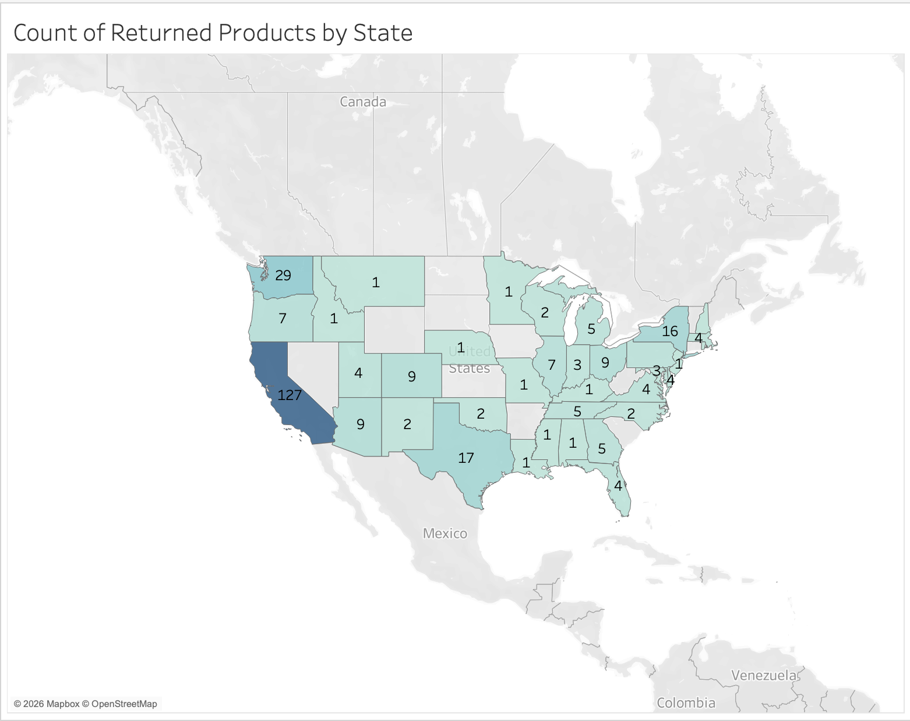
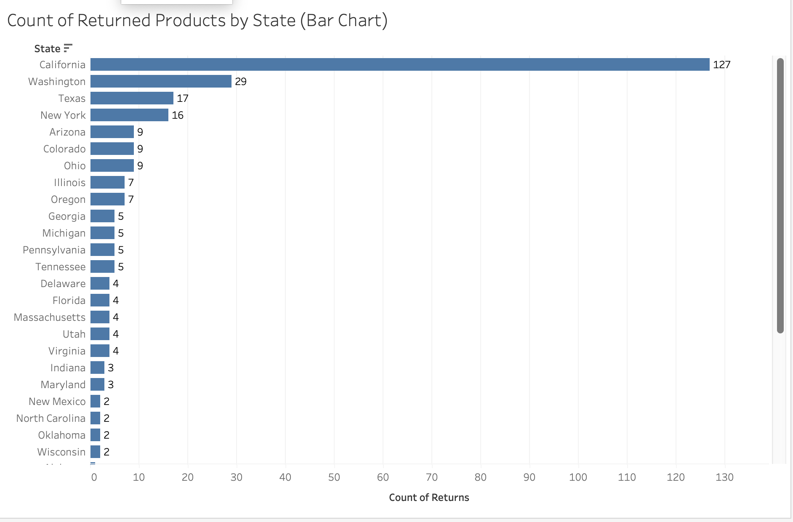
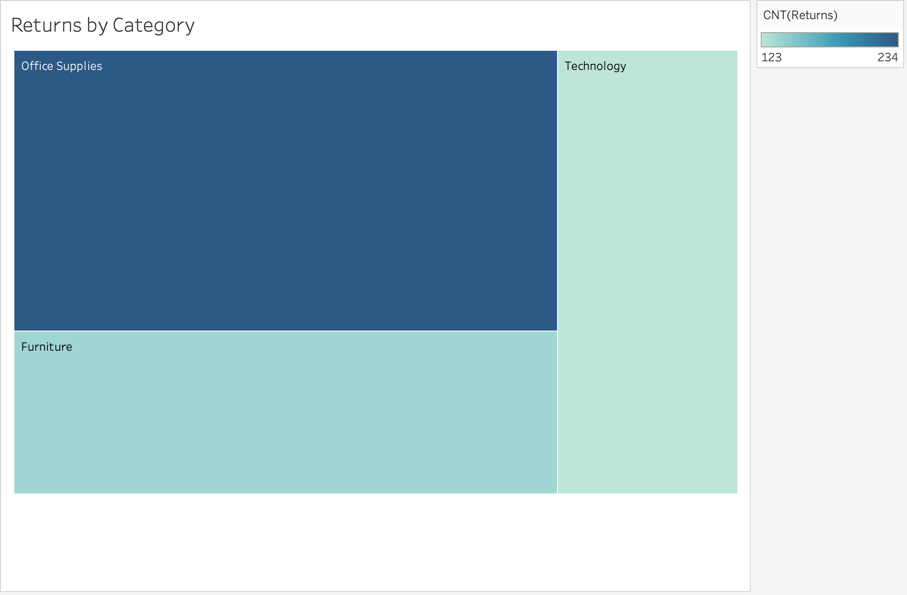
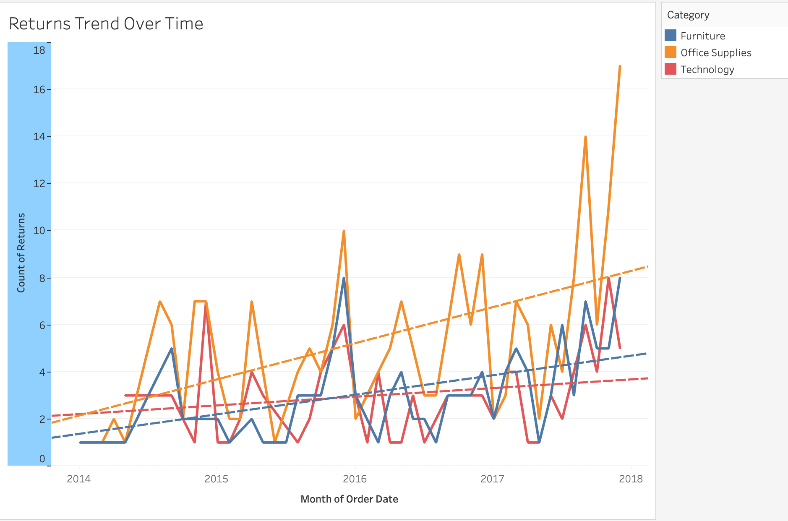
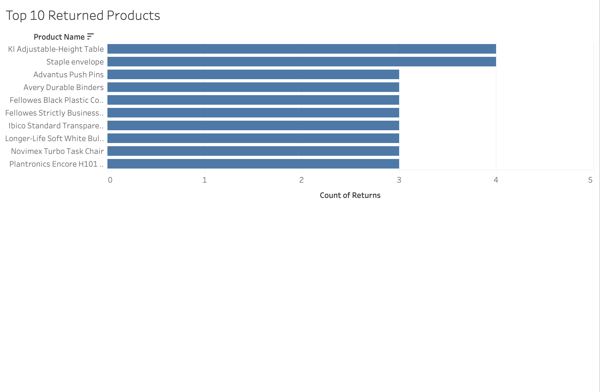

# 📊 Superstore Returns Analysis – Tableau

## Overview
Descriptive analytics project using Tableau to analyze 
product return patterns from the Sample Superstore dataset.
Performed as part of CSC4404 Data Analytics coursework.

## 🛠️ Tools Used
- Tableau Public
- Microsoft Excel (.xls)

## 📂 Dataset
Sample Superstore dataset — Orders and Returns tables 
joined on Order ID.

## 🔍 Key Findings
- **State with highest returns:** California (127 returns)
- **Top returned product:** Acco Six-Outlet Power Strip 4' Cord Length
- **Most returned category:** Office Supplies (234 returns)
- **Trend:** Returns show an upward trend from 2014–2017 with seasonal spikes in Q4

## 🌐 Live Dashboard
[View Interactive Dashboard on Tableau Public](https://public.tableau.com/views/SuperstoreReturnsAnalysis_17760644661490/Dashboard1)

## 📊 Visualizations

### 🗺️ Map Visualization — Returns by State

### 📊 Bar Chart — States Ranked by Returns

### 🟦 Treemap — Returns by Category

### 📈 Trend Line — Returns Over Time

### 🏅 Top 10 Most Returned Products

## 💡 Skills Demonstrated
- Data joining in Tableau
- Geographic map visualization
- Treemap and bar chart creation
- Time series trend analysis
- Descriptive analytics
- Data-driven insight communication
